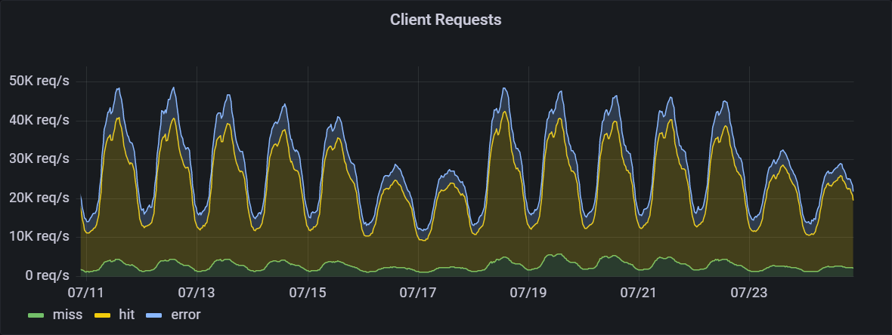
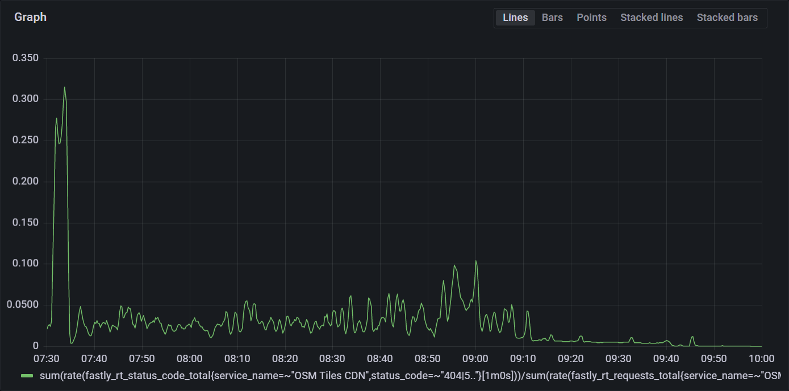

The OpenStreetMap Standard Tile Layer experienced degraded service from 2022-07-18T07:30:00Z to 2022-07-18T10:00:00Z, a total incident of 2 hours and 30 minutes. An apache bug was the cause.

## Service background
The standard tile layer is the default map on openstreetmap.org, and is also used by other sites and apps. As of June 2022, the traffic was 72 billion requests/month, with a daytime peak of 50 000 requests/second. Traffic is highest during the weekday between 10:00 and 16:00 local time in each region. Across the world, usage is highest between 06:00 UTC and 21:00 UTC.  Under normal operation the hit ratio of the CDN is 89%.

The architecture consists of a content delivery network (CDN) hosted by [Fastly](https://www.fastly.com/blog/how-openstreetmap-uses-our-modern-cdn-to-push-near-instant-updates-worldwide), backed by 7 rendering servers. The OpenStreetMap Foundation runs 4 render servers in Europe, 2 in Australia, and 1 in the USA. Fastly distributes traffic by geographic location to the nearest set of servers, with the US East coast and Africa going to Europe for load reasons.

Within Europe, Fastly additionally distributes traffic by map location, with "odd" metatiles going to one set of servers, and "even" metatiles going to another.

| Server   | [Relative capacity](https://github.com/openstreetmap/chef/pull/513#issue-1304362286) | Location                        | Traffic Served |
|:--------|:---|:-------------------------------|:--------------|
| [odin](https://hardware.openstreetmap.org/servers/odin.openstreetmap.org/) | 1 | Amsterdam, Netherlands | Europe "even" traffic
| [nidhogg](https://hardware.openstreetmap.org/servers/nidhogg.openstreetmap.org/)  | 1 | Umeå, Sweden | Europe "even" traffic
| [ysera](https://hardware.openstreetmap.org/servers/ysera.openstreetmap.org/)    | 3 | Slough, United Kingdom | Europe "odd" traffic
| [culebre](https://hardware.openstreetmap.org/servers/culebre.openstreetmap.org/)  | 3 | Dublin, Ireland | Europe "odd" traffic
| [balerion](https://hardware.openstreetmap.org/servers/balerion.openstreetmap.org/) | 1 | Carlton, Victoria, Australia | Australia and Asia
| [bowser](https://hardware.openstreetmap.org/servers/bowser.openstreetmap.org/)   | 1 | Carlton, Victoria, Australia | Australia and Asia
| [pyrene](https://hardware.openstreetmap.org/servers/pyrene.openstreetmap.org/)   | 0.5 | Portland, Oregon, United States | South America and West Coast of North America

## Outage summary
A [bug in Apache](https://bz.apache.org/bugzilla/show_bug.cgi?id=66004) caused all render servers to decrease in capacity, causing a complete outage of the US render server, and rolling failures of the CDN-level healthchecks of European render servers, resulting in traffic shifting between backends. Partial recovery occured when health check settings were changed and complete recovery when Apache was restarted.

Total customer impact was a 4% failure rate lasting for 2.5 hours.

## Timeline
* 2022-07-10T07:09:30Z - Pyrene OS and Apache upgrade.
* 2022-07-13T08:30:00Z - Ysera and Odin OS and Apache upgrade.
* 2022-07-13T17:15:00Z - Nidhogg and Culebre OS and Apache upgrade.
* 2022-07-17T00:00:00Z - Daily automatic log rotation starts.
* 2022-07-17T00:02:30Z - Pyrene fails health checks, sending all US traffic to European servers over the course of 60 seconds.
* 2022-07-18T06:00:00Z - Ysera traffic starts oscillating approximately every 120 seconds: traffic goes between a maximum and close to zero.
* 2022-07-18T06:10:00Z - [Operations ticket](https://github.com/openstreetmap/operations/issues/685) created for oscillating ysera traffic.
* 2022-07-18T07:18:00Z - Nidhogg traffic starts oscillating like ysera.
* 2022-07-18T07:20:00Z - Odin traffic starts oscillating like ysera.
* 2022-07-18T07:26:00Z - Culebre traffic starts oscillating like ysera.
* 2022-07-18T07:30:38Z - Fastly config #305 pushed with error mis-directing traffic to ysera.
* 2022-07-18T07:33:18Z - Fastly config #304 restored.
* 2022-07-18T07:36:27Z - Fastly config #306 pushed removing ysera from "even" Europe group to test.
* 2022-07-18T07:49:00Z - Ysera server logs reviewed, establishing that it was still getting significant traffic. Operations incorrectly suspected this to be related to traffic hitting the render servers directly, [which had happened before](https://github.com/openstreetmap/operations/issues/679).
* 2022-07-18T07:52:41Z - Fastly config #304 restored as test complete.
* 2022-07-18T08:12:00Z - Fastly contacted by email from incorrect email address.
* 2022-07-18T08:19:00Z - Fastly ticket #517787 created through web interface as urgent priority.
* 2022-07-18T08:27:00Z - Fastly responds, asking for more details about changes around the incident start time.
* 2022-07-18T08:43:07Z - Fastly config #307 pushed removing odin from fallback server groups.
* 2022-07-18T08:51:36Z - Fastly config #308 pushed removing odin, causing odin's load to go to zero.
* 2022-07-18T08:57:00Z - [OSM_Tech tweet](https://twitter.com/OSM_Tech/status/1548955132011749376) issued about service degredation
* 2022-07-18T08:59:36Z - Fastly config #309 pushed bringing odin origin in again at minimal load.
* 2022-07-18T09:08:00Z - Fastly config #310 pushed to make health check more forgiving of down servers, immediately smoothing traffic levels out and reducing error rate.
* 2022-07-18T09:19:00Z - Fastly provides details on [how to monitor health check status](https://support.fastly.com/hc/en-us/community/posts/360040444872-Monitoring-health-status-from-fastly-health-checks#:~:text=Regarding%20this%20topic%2C%20yes%2C%20we%27re%20aware%20of%20your%20needs%20as%20this%20is%20one%20of%20the%20frequently%20asked%20questions.).
* 2022-07-18T09:35:00Z - Fastly config #311 pushed to create health check API created based on Fastly instructions.
* 2022-07-18T09:38:38Z - Fastly config #312 pushed improving health check API.
* 2022-07-18T09:39:00Z - Apache Scoreboard examined on cluebre, showing scoreboard is full.
* 2022-07-18T09:45:00Z - Restart of Apache on all backends completed, service restored to normal.
* 2022-07-18T10:05:00Z - [OSM_Tech tweet](https://twitter.com/OSM_Tech/status/1548972120184475648) about service back to normal
* 2022-07-18T10:09:08Z - Fastly config #313 pushed to restore normal load balancing and increase health check frequency.

## What went wrong
A [bug in Apache](https://bz.apache.org/bugzilla/show_bug.cgi?id=66004) caused all render servers to decrease the number of connections they had capacity for each day when the server was reloaded for log rotation. The US server was upgraded first, and its capacity hit zero on 2022-07-17, causing its traffic to fail over the European servers. This caused no immediate problems with the low weekend traffic levels, and no alarms were triggered. The US traffic had a disporportate effect on the European servers because it was not split into "even" and "odd" requests, meaning half the requests required a metatile that didn't exist on the server.

The same bug also reduced the capacity of all servers, with ysera the most impacted. As traffic levels increased as the European day on started 2022-07-18 this caused ysera to reach its capacity, causing it to fail the health checks, which shifted traffic to other servers. This freed the capacity of ysera, causing it to pass the health check, and get full traffic again.

When the other servers were at capacity, the same behaviour started on them. With all four servers alternately failing and passing health checks the traffic was bouncing between servers, overloading each in turn. This load sometimes caused the servers to fail to respond to requests, or fail to render new tiles.

While this was happening, the servers were responding when manually health checked, so Operations did not realise that they were failing the health checks done by Fastly.

Operations pushed Fastly config #305 with an error that misdirected all traffic to ysera, but reverted it in 2 minutes 40 seconds. Operations pushed a fixed config that would have normally removed all ysera traffic, but due to the multiple failures, did not. The metrics showed traffic still going to ysera. This led to the incorrect hypothesis that someone was bypassing the CDN, which [has happened before](https://github.com/openstreetmap/operations/issues/679).

Operations then pushed Fastly config #310 to alter the health check and make it only require 1/5 of checks be successful. This improved the oscillating load (traffic going between a maximum and close to zero), but did not fix it completely. Eventually, Operations identified an Apache bug as a root cause, and Apache was restarted across all the servers, freeing up connections and restoring normal service.

# Corrective measures

- Simplify the fastly origin config so each server appears at most once. _DONE_
- Adjust the fastly origin config so when US traffic fails over to Europe, it follows the even/odd breakdown. _DONE_
- [Document how to open an urgent ticket with Fastly](https://github.com/openstreetmap/operations/issues/693)
- Investigate how to monitor Fastly's health check responses [_DONE_](https://github.com/openstreetmap/operations/issues/695)
- Add a prometheus alert for hosts shown as down by Statuscake [_DONE_](https://github.com/openstreetmap/chef/commit/2fb1b5fe069034178b0d1426bba953e7b3a661ad)
- Add a prometheus alert for unusually low apache request rates [_DONE_](https://github.com/openstreetmap/chef/commit/12e55b9a956bcbed90ce4f925ef56e9e1812eda0)
- Backport Apache fix _DONE_
